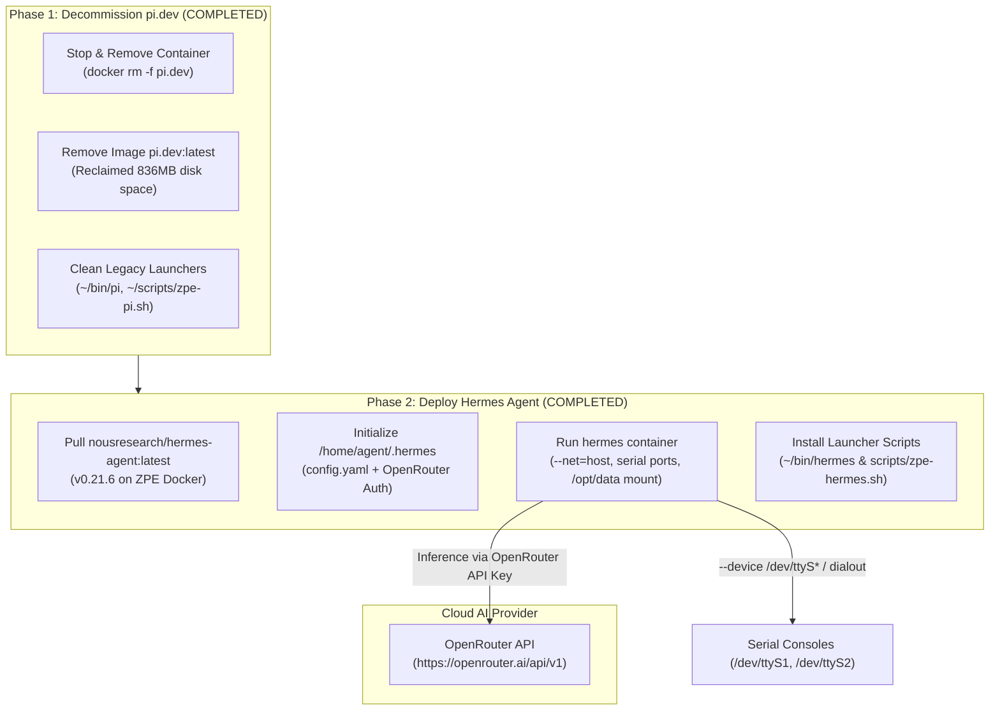

# Implementation Plan: Decommission `pi.dev` & Deploy `hermes` Agent Harness on ZPE

> **STATUS: FINAL / COMPLETED**  
> **Execution Date:** 2026-10-09  
> **Result:** Successfully executed and verified on `RM1-ZPE` (`100.119.254.114`). Container `hermes` (`nousresearch/hermes-agent:latest` v0.21.6) is active and serving OpenRouter inference.

---

## Goal Description
Safely decommission and remove the lightweight `pi.dev` container and image from the **ZPE Systems Nodegrid appliance** (`RM1-ZPE` at `100.119.254.114`) and replace it with **Hermes Agent** ([`nousresearch/hermes-agent`](https://hub.docker.com/r/nousresearch/hermes-agent)). 

Hermes Agent provides a full-featured autonomous agent platform supporting tool-calling (bash, file I/O, git, serial console), multi-turn reasoning, memory persistence, skills, and native integration with **OpenRouter**.

---

## Architecture & Storage Specifications

* **Appliance Host**: ZPE Systems Nodegrid (`RM1-ZPE` — `100.119.254.114`)
* **Docker Engine**: Docker 24.0.9-ce on Linux 5.15.169-yocto-standard (x86_64)
* **Active Container**: `hermes` (`nousresearch/hermes-agent:latest`)
* **State & Memory Database**: `/home/agent/.hermes` ➔ `/opt/data`
* **Workspace Directory**: `/home/agent/workspace` ➔ `/workspace`
* **Hardware Serial Ports**: `/dev/ttyS1`, `/dev/ttyS2` (passed to container with `dialout` group permissions)
* **Docker Daemon Socket**: `/var/run/docker.sock` passed through for container management

---

## Design Decisions (Resolved)

1. **Default AI Model**:
   * **Active Default**: `deepseek/deepseek-v4-flash-0731` via OpenRouter (tested, fast response time, reliable tool-calling).
   * **Alternative Models**: Users can switch anytime to `anthropic/claude-sonnet-4.5`, `anthropic/claude-sonnet-5`, or `openai/gpt-4o-mini` using `/model <name>` inside chat.
2. **Operational Mode**:
   * **Interactive CLI Daemon**: Running in background under supervised s6 process manager, ready for interactive access (`hermes` on ZPE or `./scripts/zpe-hermes.sh` remotely) and batch tasks (`hermes -z "..."`).

---

## Implemented Components & Scripts

### 1. Configuration (`docker/hermes/`)
* **`docker/hermes/config.yaml`**: Pre-configured configuration setting provider to `openrouter`, base URL to `https://openrouter.ai/api/v1`, working directory `/workspace`, and default model `deepseek/deepseek-v4-flash-0731`.
* **`docker/hermes/.env`** *(Git-ignored)*: Holds `OPENROUTER_API_KEY`.
* **`docker/hermes/.env.example`**: Sanitized template for version control.

### 2. Operational Automation (`scripts/`)
* **[`scripts/decom-pi-dev.sh`](file:///home/ubuntu/zpenodegrid/scripts/decom-pi-dev.sh)**: Executable script to purge `pi.dev` container, image, and launchers.
* **[`scripts/deploy-hermes-to-zpe.sh`](file:///home/ubuntu/zpenodegrid/scripts/deploy-hermes-to-zpe.sh)**: Full deployment and initialization script.
* **[`scripts/zpe-hermes.sh`](file:///home/ubuntu/zpenodegrid/scripts/zpe-hermes.sh)**: Remote one-command SSH launcher.

### 3. Appliance Local Launchers (`RM1-ZPE`)
* **`/home/agent/bin/hermes`**: Quick launcher in `PATH`.
* **`~/zpe-hermes.sh`**: Convenience symlink in home directory.

---

## Verification & Execution Results

| Verification Item | Command / Test | Result |
|---|---|---|
| **Container Decommission** | `docker ps -a \| grep pi.dev` | Clean (Zero containers) |
| **Image Decommission** | `docker images \| grep pi.dev` | Clean (Image removed, 836MB reclaimed) |
| **Hermes Container Status** | `ssh agent@100.119.254.114 "docker ps"` | `hermes` container status `Up` |
| **Hermes Binary & Version** | `docker exec hermes hermes --version` | `Hermes Agent v0.21.6 (2026.9.24)` |
| **OpenRouter Inference** | `hermes -z "Say exactly: Default OpenRouter model working smoothly on ZPE!"` | **Passed**: `Default OpenRouter model working smoothly on ZPE!` |
| **Serial Pass-Through** | `docker exec hermes ls -la /dev/ttyS1 /dev/ttyS2` | Both devices mounted with `dialout` write permissions |
| **Local Launcher** | `/home/agent/bin/hermes --version` | **Passed**: `Hermes Agent v0.21.6` |
