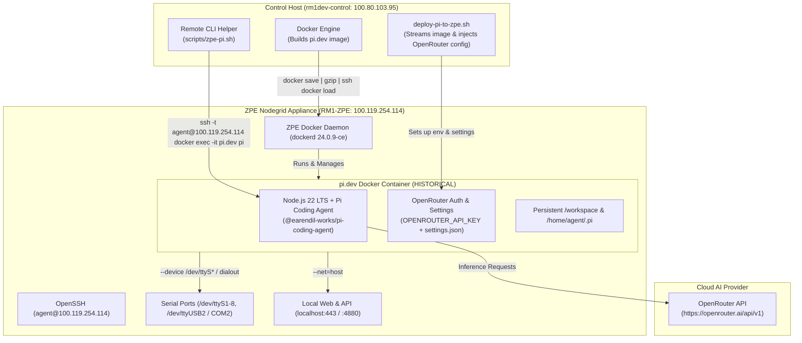

# Implementation Plan: Deploy `pi.dev` Container Harness on ZPE Docker (Configured for OpenRouter)

> **STATUS: HISTORICAL / SUPERSEDED — DECOMMISSIONED ON 2026-10-09**  
> **Note:** This plan was successfully implemented and tested on `RM1-ZPE`. The `pi.dev` container was subsequently decommissioned and replaced by **Hermes Agent** per [plan-decom-pi-dev-and-replace-with-hermes.md](./plan-decom-pi-dev-and-replace-with-hermes.md).

---

## Goal Description (Historical Archive)
Deploy a dedicated Docker container named **`pi.dev`** directly onto the **ZPE Systems Nodegrid appliance** (`RM1-ZPE` at `100.119.254.114` / `192.168.0.17`). The container runs the open-source **Pi Coding Agent** ([`pi.dev`](https://pi.dev) / `@earendil-works/pi-coding-agent`), configured out-of-the-box with **OpenRouter** as the primary AI model provider using your OpenRouter API key.

---

## Decommission Summary

1. Container `pi.dev` stopped and removed on `RM1-ZPE`.
2. Image `pi.dev:latest` purged from `RM1-ZPE` and `rm1dev-control` (reclaiming ~836MB disk space).
3. Legacy launcher links (`/home/agent/bin/pi`, `/home/agent/scripts/zpe-pi.sh`) removed on `RM1-ZPE`.
4. State directory `/home/agent/.pi` backed up to `/home/agent/.pi.bak.*`.
5. Active replacement is **Hermes Agent** (`nousresearch/hermes-agent:latest`), documented in [`docs/hermes-zpe-harness.md`](./hermes-zpe-harness.md).
